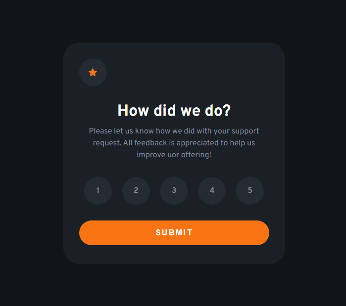
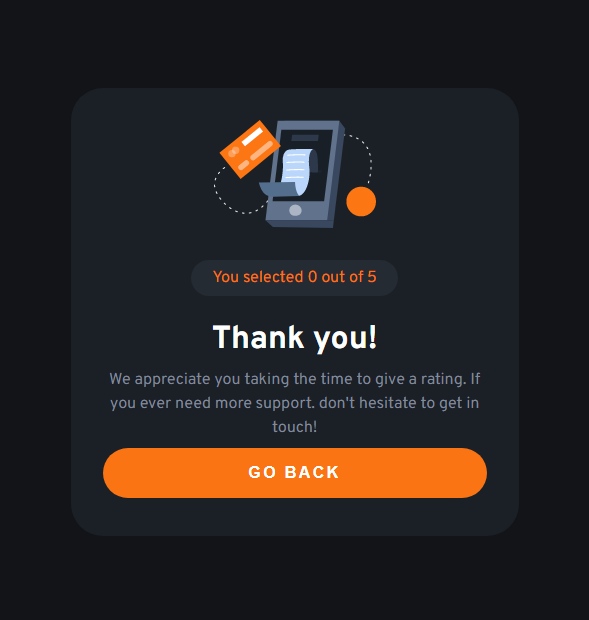

# Projeto | Interactive Rating Component

### Desenvolvido como projeto de estudo.

### Focos de estudo: React.js

Confira o resultado [clicando aqui](https://jeanwisotscki.github.io/interactive-rating-component/) (Dica: control + click para abrir o link em uma nova guia. 😉)

# Screenshots

# Techs usadas no desenvolvimento

- React.js
- JSX
- HTML
- CSS
- GIT

# Desenvolvido por

- [@jeanwisotscki](https://github.com/jeanwisotscki/)
